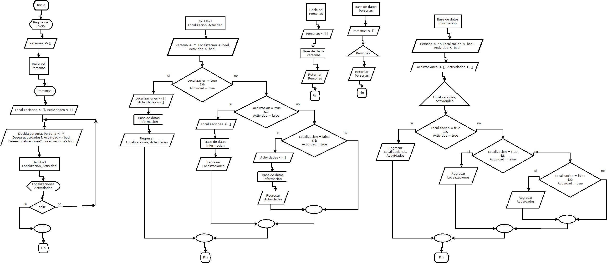

# Introduccion  
Con el avance de la tecnología, lo más probable que cualquier persona piense, es que todos los procesos cada vez son más autónomos y sencillos de realizar, pero la tecnología nunca puede reemplazar el hecho de que las personas se ocupan comunicar físicamente, para hablar de temas un poco más importantes.
Y ese es el objetivo de la aplicación a desarrollar, dar a entender que nada puede cambiar el hecho de que es importante comunicarse físicamente, para así no obtener ningún malentendido.
Con ello, se realizara un sistema web donde los usuarios que esten dentro del sistema, puedan pedir ayuda para localizar a un ente, objeto, etcetera, esto no siendo geolocalizacion, sino trabajando con la informacion que otras personas proporcionen.    

## Metodologia de trabajo  
Para la metodología a implementar, se pretende hacer de uso del prototipado.  
Con el hecho de que se puede dar una versión mínima a presentar, y gradualmente dar a conocer mejores versiones de ello. Esto siendo muy conveniente, ya que el llenado de información se da de poco en poco.  

# Planteamiento del problema  
Siendo estudiantes, trabajadores, o cualquier tipo de persona con una actividad constante, que te obliga a no estar en una ubicación fija, a veces resulta difícil para otras personas conocer o saber donde se encuentran aquellas personas con las que ocupan hablar físicamente, por lo cual debido a que no hay aplicaciones populares que resuelvan este problema, hay necesidad de un sistema para conocer la ubicación de las personas de interes propio.

# Objetivos  
## General
Se desarrollara e implementara un sistema web para que las personas puedan pedir ayuda o investigar informacion previa sobre donde se localiza una persona, y si no se encuentra de la primera forma, tener indicios para encontrarlo con facilidad. Aplicado a una Institucion Educativa.  

## Especificos
* Creación de aplicación web usando un formato adaptable apoyándose de html/css y javascript además de algunas librerías como Jquery y/o bootstrap.
* Diseño, creacion, modificacion y montaje de la base de datos.
* Configuracion y montaje de un BackEnd con un lenguaje de programacion apropiada para lo que se desea desarrollar.
* Creación de aplicacion nativa móvil y para escritorio usando lenguajes como c++, ruby y javascript.
* Configuración de servidor web para patrocinar el sistema a otros usuarios.  

# Justificacion  
Dentro del Instituto Tecnológico de Tijuana, en ocasiones se requiere encontrar a una persona, ya sea por motivos académicos y/o personales. Sin embargo, no siempre está disponible en el lugar que se querría encontrar.  
Por ello, si alguien más puede saber de su localización, otras personas pueden saber de sus previos lugares de encuentro. Y si están grabadas digitalmente, mucho mejor.  

# Estado de arte  
En cuanto a aplicaciones web, las tendencias actuales se resumen algunas, gracias a 40DeFiebre[^1]:  

[^1]: https://www.40defiebre.com/tendencias-diseno-web-2016/

* Nuevo Diseño Flat: "Google nos lo presentó hace ya (casi) un par de años, la digievolución de lo que ya era una realidad. Lo llamó Material design. Dicen que para su creación se inspiraron en la tinta y el papel."  
* Tipografia: "Otra de las tendencias en diseño web que veremos cada vez más frecuentemente es el uso expresivo de la tipografía. Se utilizará como forma y no como medio para comunicar, o dicho de otra forma, se ilustrará con letras."  
* Patrones UI: "Estos patrones guían al usuario mientras navega por tu web. Te solucionarán más de una papeleta. Úsalos, funcionan."  

En cuanto a las tendencias a utilizar, Python es una de las cuales se apoyan mas recientemente[^2]:

[^2]: https://bbvaopen4u.com/es/actualidad/tendencias-en-desarrollo-de-software-para-2016

"El desarrollo de software moderno con soluciones como el cuarteto MEAN (MongoDB, ExpressJS, AngularJS y Node.js) o el uso de tecnologías de Big Data como Spark impulsan otro tipo de lenguajes de programación como JavaScript, Python o Scala por encima de Java, una sintaxis que hace años era una puerta de entrada casi segura en el mercado profesional del desarrollo. Hoy todavía sigue siéndolo, pero su poderío mengua con el paso del tiempo.

Una simple búsqueda en indeed, el portal de empleo y tendencias, marca curvas claras para todas las sintaxis que hemos mencionado: Java claramente a la baja, JavaScript y sobre todo Python y Scala, al alza. Lógicamente, el mercado americano es muy distinto al mercado español. Eso es importante."  

Por ultimo, tambien una tecnologia a implementar son los lenguajes de programacion del lado del cliente. JavaScript liderando la marcha[^3]:

[^3]: https://www.unocero.com/2016/03/28/los-nueve-lenguajes-mas-demandados-en-el-2016/

"Javascript es probablemente el “nuevo BASIC”. Así como en los años ochenta del siglo pasado, cuando empezaban a surgir las computadoras de 8 bits que corrían casi todas algún tipo de intérprete de BASIC, hoy Javascript es el equivalente en la tecnología moderna para crear páginas web, escribir juegos relativamente simples y es sin duda, el lenguaje de scripts más popular de la web. Los navegadores más populares tienen incluido un intérprete de Javascript y probablemente una inmensa mayoría de sitios web usen algún elemento de Javascript en sus páginas. Ahora, además, se ha incorporado Node.js, una tecnología de servidores que permite a Javascript comunicación en tiempo real."  

# Analisis de sensibilidad  
En cuanto al tiempo, se da a consideracion que se invertiran minimo 3 horas de desarrollo por semana por cada persona involucrada, en un promedio de inversion de 10 horas por semana.  
Lo anterior con un tiempo de completacion de 5 meses.

# Costo  
Debido al proyecto sera aplicado a una institucion educativa (y para fines de investigacion), se dara el cobro de $15 dolares por hora, esto siendo considerado como un apoyo a los desarrolladores.  

Con el costo y el tiempo a invertir, se puede hacer los calculos:  

10 horas por semana x 5 meses = 200 horas para terminar.
200 horas x $15 dolares por hora = $3000 dolares por desarrollo completo.

Los gastos incluyendo el mantenimiento del proyecto siendo:  

Actividad | Costo (dolares)
--------- | ---------------
Desarrollo | $3000.00
Servidor | ~$500.00
Soporte Tecnico | Variado (No se cubre)
Recursos (Electricidad, componentes de reemplazo, etcetera) | Variado (No se cubre)

# Marco Teórico
Se pretende desarrollar un software que pueda ser aplicado en
una zona limitada geográficamente.  
Esto pudiendo ser:  
* Una institución.
* Un edificio.
* Departamentos.
Con lo anterior, será de uso en una institución educativa, con el
propósito de apoyar en la localización de personas que
posiblemente no se encuentren en su lugar de estadía común.

## Identificación de las variables
Variable dependiente: Ubicación de las personas interesadas a
encontrar y sus actividades que realizan con más frecuencia.
Variable independiente: El tiempo que tardaría en llegar en el
lugar donde se encuentra la persona a buscar.
Variables de control: Todos los partícipes en una zona. En este
caso en una institución educativa.

# Metodologia

## Analisis del problema  
1. Formular.
  a. Se necesita un sistema el cual proporcione información sobre los lugares y actividades comunes de
  las personas que tramitan un lugar específico. Para este sistema una institución educativa.
2. Resultados esperados.
  a. Una plataforma donde:
    i. Se pueda dar de alta información donde un usuario pueda dar de alta los lugares y actividades
    comunes de una persona.
    ii. Revisar la información previa que se ha dado de alta.
3. Datos disponibles.
  a. Personas.
  b. Lugares.
  c. Actividades.
4. Restricciones.
  a. No repetir las personas que existen. Evitar redundancia.
  b. Las actividades y lugares que realicen las personas solo deben ser las que sean dentro del lugar.
5. Procesos necesarios.
  a. Alta y consulta de:
    i. Personas.
      1. Actividades.
      2. Lugares.

## Diseño del algoritmo
### Principal
1. Inicio.
2. Pagina de inicio.
3. Personas <- [].
4. BackEnd, "Personas".
5. Desplegar, Personas.
6. Localizaciones <- [], Actividades <-
[].
7. Desplegar "Decida persona",
Persona <- "".
8. Desplegar "Desea actividades?",
Actividad <- bool
9. Desplegar "Desea localizaciones?",
Localizacion <- bool
10. BackEnd, "Informacion".
11. Desplegar Localizaciones,
Actividades.
12. Si salir = true, paso 13. Sino, paso
7.
13. Fin.

### Base de datos
#### Personas
1. Inicio.
2. Personas <- [].
3. Extraer, Personas.
4. Retornar, Personas.
5. Fin.

#### Información
1. Inicio.
2. Persona <- "", Localizacion <- bool, Actividad <-
bool.
3. Localizaciones <- [], Actividades <- [].
4. Extraer, Localizaciones, Actividades.
5. Si Localizacion = true && Actividad = true, paso
6. Sino, paso 8.
6. Regresar Localizaciones, Actividades.
7. Paso 14.
8. Si Localizacion = true && Actividad = false, paso
9. Sino, paso 11.
9. Regresar Localizaciones.
10. Paso 14.
11. Si Localizacion = false && Actividad = true,
paso 12. Sino, paso 14.
12. Regresar Actividades.
13. Paso 14.
14. Fin.

### BackEnd
#### Personas
1. Inicio.
2. Personas <- [].
3. Base de datos, Personas.
4. Retornar, Personas.
5. Fin.

#### Localizacion_Actividad
1. Inicio.
2. Persona <- "", Localizacion <- bool,
Actividad <- bool.
3. Localizacion = true && Actividad = true,
paso 4. Sino, paso 7.
4. Localizaciones <- [], Actividades <- [].
5. Base de datos, Informacion.
6. Regresar Localizaciones, Actividades.
7. Localizacion = true && Actividad = false,
paso 8. Sino, paso 11.
8. Localizaciones <- [].
9. Base de datos, Informacion.
10. Regresar Localizaciones.
11. Localizacion = false && Actividad = true,
paso 12. Sino, paso 15.

**Diagrama de flujo**
  

## Depuracion del procedimiento.  
Debajo una captura del funcionamiento de la primera version de la pantalla de inicio. Aunque faltan las funciones de de poder pedir la busqueda de un ente y la vista de perfil.

# Programacion aplicada
**Programación Imperativa**  
**Programación Orientada a Objetos**  
Considerando que se van a introducir y leer datos ingresados, y los datos siendo ingresados de acuerdo a opiniones de usuarios, se realiza como una programación imperativa.
Los lenguajes de programación principal siendo Javascript y PHP. Incluyendo un lnguaje de programacion especifico, cualquiera que se desee. En este caso, con uso de MySql.

# Desarrollo
Para cumplir con los requerimientos, se da la necesidad de cubrir lo siguiente para un sistema web:
* FrontEnd
* BackEnd
* Base de datos

Para ello se proporcionan los diferentes resultados.

## FrontEnd
Para las vistas, se da un detalle minimalista, que da la informacion que se requiere sin muchas animaciones. Esto para mejorar el rendimiento de renderizado de la pagina hacia al usuario.

**Pantallas**

## BackEnd
En cuanto al manejo de datos, se manejan solo conexiones y operaciones con bases de datos, con una metodologia de programacion orientada a objetos. Esto siendo para que, aun con el objetivo de utilizar un solo sistema manejador de bases de datos, se pueda adaptar si se desea migrar a otra plataforma, o inclusive usar otras en conjunto.  
Todas las operaciones siendo controladas por medio de procedimientos almacenados, dando otra capa de seguridad y usabilidad a la aplicacion.

**Pantallas**

## Base de datos
Para el manejador de la base de datos, se utiliza MySql. Utilizado este por su compatibilidad con varios sistemas operativos (Windows y variantes de Unix en especifico).

**Pantalla Ejemplo**

# Implementacion. Optimizacion
## Reduccion de archivos
Para darle funcionalidad a una pagina web, se implementan archivos que se ejecutan del lado del cliente. Si hay muchos archivos al cargar una pagina, esta se alenta.
Para mejorar el rendimiento, modulos puestos en otros archivos se pueden poner en uno solo o en una cantidad menor. De esta forma, la pagina se renderiza mas rapido.

**Ejemplo de velocidad**

## Llamadas en paralelo (No comprobado)  
Un punto no comprobado es la optimizacion utilizando llamadas paralelas de archivos. Esto, utilizando un archivo de un patrocinado (CDN). Debido a la minima cantidad de archivos en utilidad, este punto no se puede comprobar con facilidad.

# Conclusion y trabajo futuro
Aunque hay ya un gran avance para reconocer las actividades y lugares comunes en los cuales participan las personas, aun es necesario implementar algoritmos/modulos que ayuden a prevenir la redundancia de datos. O bien, dar a los usuarios los lugares y actividades veridicas de otras personas definido en cuanto a "feedback" de quienes utilicen la informacion.

Aun asi, la idea y utilidad minima ya esta definida y usable.

# Bibliografia  
1. Michelone, M. L. (2016, March 28). Los lenguajes de programación más demandados en 2016. Retrieved September 07, 2016, from https://www.unocero.com/2016/03/28/los-nueve-lenguajes-mas-demandados-en-el-2016/  
2. Rodriguez, C. (n.d.). Tendencias en diseño web para 2016 (con ejemplos). Retrieved September 07, 2016, from https://www.40defiebre.com/tendencias-diseno-web-2016/  
3. Tendencias en desarrollo de software para 2016. (2016, February 01). Retrieved September 06, 2016, from https://bbvaopen4u.com/es/actualidad/tendencias-en-desarrollo-de-software-para-2016  
4. Capitulo 2 Marco Teorico. (n.d.). Retrieved September 20, 2016, from http://catarina.udlap.mx/u_dl_a/tales/documentos/lis/flores_r_mi/capitulo2.pdf
